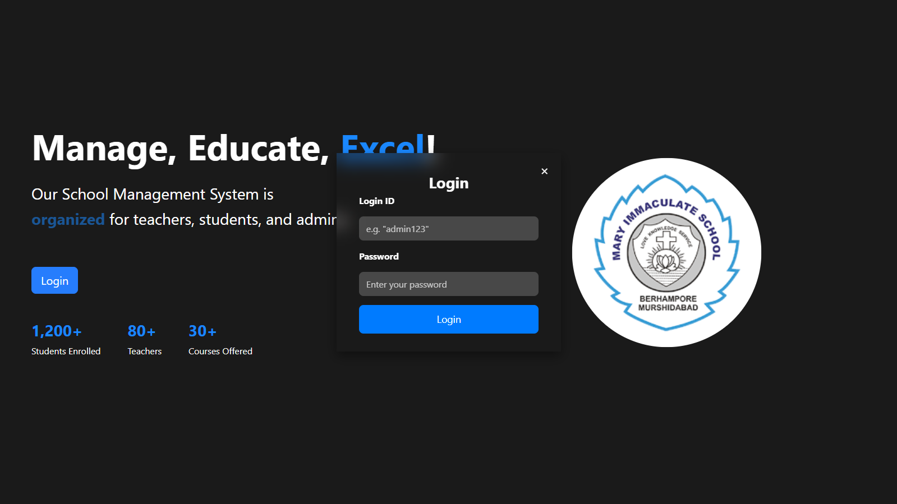
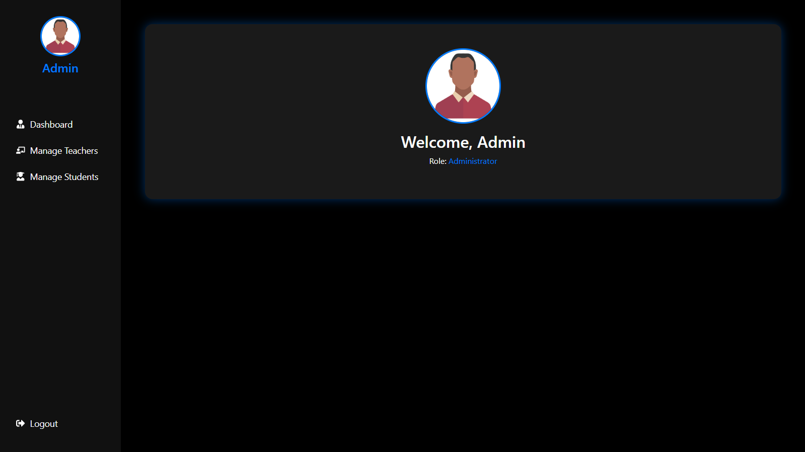
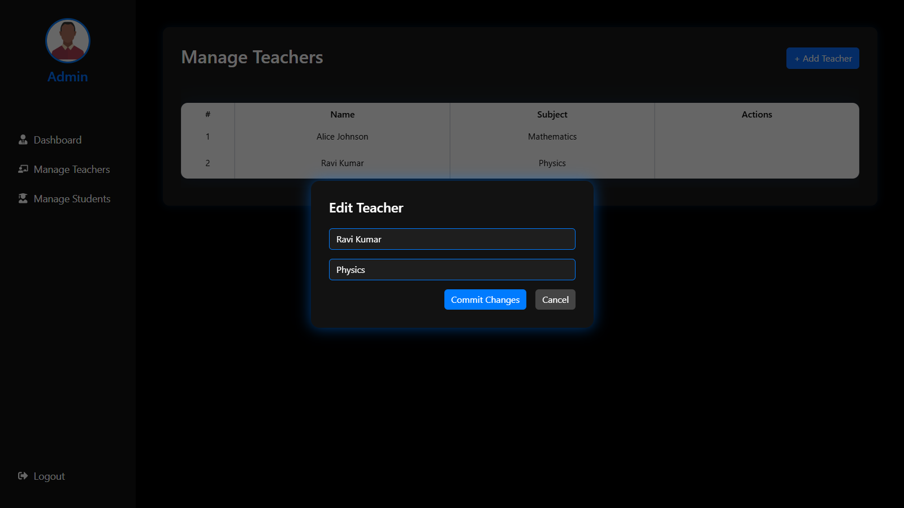
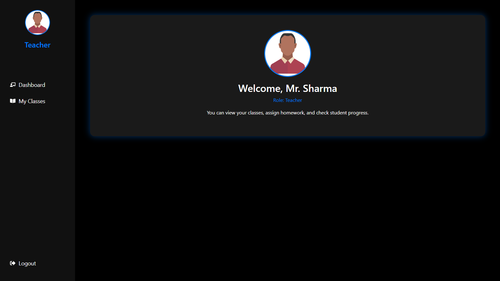
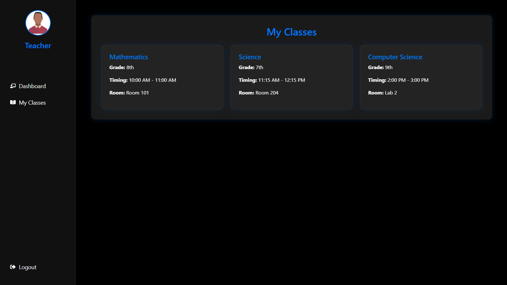
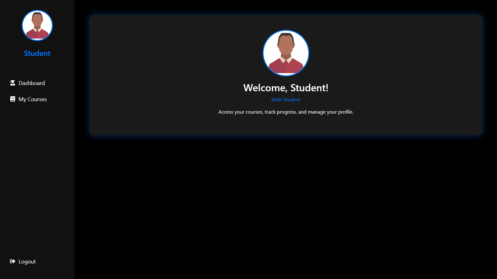
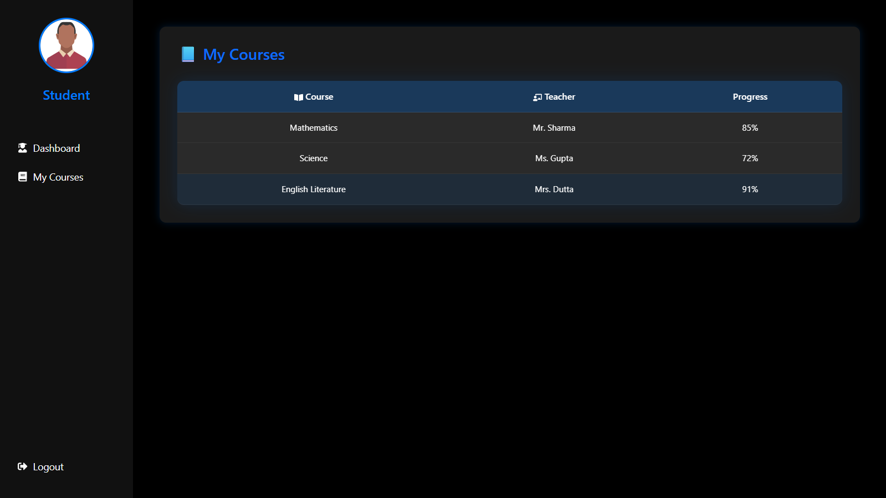

# 🏫 School Management System - MERN Stack

A **modern role-based School Management System** built with **React (frontend)**. Users can log in as **Admin**, **Teacher**, or **Student**, and each role gets a beautiful, personalized dashboard and set of features.

## 🔥 Features

- 🎯 Role-based Login System (Admin, Teacher, Student)
- 🎨 Hero Landing Page with Animated Text & Image
- 👤 Admin Dashboard:
  - View, Add, Edit, Delete Teachers & Students
- 👩‍🏫 Teacher Dashboard:
  - View Assigned Classes
- 🎓 Student Dashboard:
  - View Enrolled Courses
- 💅 Glassmorphic UI using only **Black, White, and Blue (#007BFF)** palette
- 🖥️ Responsive & Clean Design

---

## 📸 Screenshots

### 🔹 Landing Page


### 🔹 Admin Dashboard


### 🔹 Manage Teachers


### 🔹 Teacher Dashboard


### 🔹 My Classes (Teacher)


### 🔹 Student Dashboard


### 🔹 My Courses (Student)


---

## 📁 Folder Structure
```
frontend/
│
├── public/
│ └── index.html
├── src/
│ ├── assets/ # Images and assets
│ ├── components/ # Shared components (Hero, Modal)
│ ├── pages/ # Role-based Dashboards
│ │ ├── AdminDashboard.js
│ │ ├── TeacherDashboard.js
│ │ ├── StudentDashboard.js
│ │ └── ...
│ ├── styles/ # CSS files
│ ├── App.js
│ └── index.js

yaml
Copy
Edit
```

---

## 🚀 Getting Started

1. Clone the repository:

```bash
git clone https://github.com/your-username/school-management-frontend.git
cd school-management-frontend

Install dependencies
npm install

Start the development server
npm start

The app will run at http://localhost:3000

✅ Default Login Credentials (Frontend Only)
Role	Login ID	Password
Admin	admin123	any value
Teacher	teacher123	any value
Student	student123	any value

Password validation is not yet implemented.
📌 To Do
🔐 Backend with authentication & token-based login

🧠 Real database integration (MongoDB)

📚 Assignments, Results, Attendance modules

📱 Mobile-responsive optimizations

🧪 Unit testing

💻 Built With
React.js

React Router DOM

Bootstrap

CountUp.js

Custom CSS (Glassmorphism)

🧑‍💻 Author
Anirban Ghosh
Frontend by @Anirban
Backend coming soon...

📄 License
This project is licensed under the MIT License.
